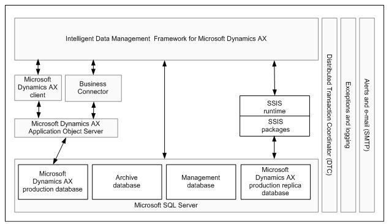
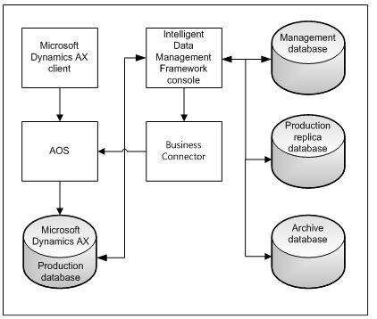
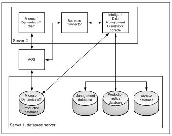
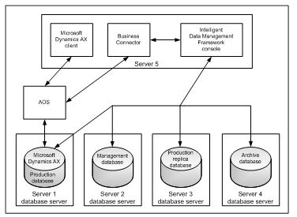

# Intelligent Data Management Framework (IDMF)

_**Applies To:** Microsoft Dynamics AX 2012 R3, Microsoft Dynamics AX 2012 R2, Microsoft Dynamics AX 2012 Feature Pack, Microsoft Dynamics AX 2012_

This topic describes the administration and use of the Microsoft Dynamics AX Intelligent Data Management Framework (IDMF). IDMF lets system administrators optimize the performance of Microsoft Dynamics AX installations. IDMF assesses the health of the Microsoft Dynamics AX application, analyzes current usage patterns, and helps reduce database size.

The Microsoft Dynamics AX Intelligent Data Management Framework (IDMF) lets you analyze the database and maintain an optimal database size. To maintain the database size, IDMF provides the purge and archive functions. The purge function removes or deletes data from a set of related entities, or tables, from the production database. The archive function moves data from all related tables from the production database to a standby database called the archive database. Users can use the archive database for reporting purposes but cannot update it. IDMF and this topic use the term offlining interchangeably with the term archiving, and purge or recycling interchangeably with deleting. Both the purge and archive operations depend on a carefully determined hierarchical relationship tree of related tables based on the Microsoft Dynamics AX metadata. To create a hierarchical relationship, you select a parent table and discover all related tables based on the Microsoft Dynamics AX metadata. The parent table in the relationship is put at the root level of the tree. The discovery process creates a nested relationship tree from a parent entity to a child entity, until there are no relationships left at the lowest level. The relationship tree that is created based on the driver table is called either a Purge Object or an Archive Object. A Purge Object is used to remove selected records from all tables in the relationship tree from the Microsoft Dynamics AX database. Similarly, an Archive Object is used to move selected records from all tables in the relationship tree from the Microsoft Dynamics AX database to the archive database. After creating a Purge Object or an Archive Object, you can apply business rules and selection criteria to entities and transactions to determine which records are deleted or moved from the production database. Finally, you create a scheduled task to purge or archive the database. At run time, a purge task selects matching records from all the tables in the Purge Object and deletes them from the production database. Similarly, an archive task selects matching records from all the tables in the Archive Object and moves them from the production database to the archive database. With careful planning and system testing, the purge and archive tasks delete or move records from the production database while maintaining the consistency and integrity of your database.

### Audience

This topic is designed for database and system administrators who are responsible for the administration and maintenance of the Microsoft Dynamics AX application and the Microsoft SQL Server database.

### Prerequisites

To benefit from this topic, you must have knowledge in the following areas:

-   Microsoft Dynamics AX application and system administration
-   SQL Server database administration, backup, recovery, and performance tuning
-   Windows Server administration, backup, recovery, and performance tuning

| **Caution**                                                                                                                                                                                                                                                                                                                                                                                                                                                                                                                                                                                                                                                                                                                    |
|--------------------------------------------------------------------------------------------------------------------------------------------------------------------------------------------------------------------------------------------------------------------------------------------------------------------------------------------------------------------------------------------------------------------------------------------------------------------------------------------------------------------------------------------------------------------------------------------------------------------------------------------------------------------------------------------------------------------------------|
| To use this topic, you must have experience in the maintenance and administration of the Microsoft Dynamics AX application and database. IDMF lets you create or modify Purge Objects and Archive Objects. A Purge Object or an Archive Object defines a hierarchical relationship tree among the Microsoft Dynamics AX application tables. You can then apply rules to select records based on specific criteria. A scheduled purge task selects records that match the criteria in the Purge Object, and deletes them from all the tables in the relationship tree. A scheduled archive task selects and moves records from the production database to the archive database that matches the criteria in the Archive Object. |

## System architecture
This section provides a high-level overview of the system architecture of IDMF. IDMF was created using the Microsoft .NET development environment and provides a single document interface (SDI). IDMF uses a database, called the management database, for the storage and retrieval of data, and communicates with an Application Object Server (AOS) instance through the .NET Business Connector. The AOS processes all the business logic and database queries to access the Microsoft Dynamics AX application database. You must install the business connector on the computer where you install IDMF. During installation, IDMF installs a Windows service called the Microsoft Dynamics AX Intelligent Data Management Framework service. This service is used to run scheduled jobs and is referred to as the scheduler service for IDMF. In the post-installation stage, IDMF uses the Microsoft Dynamics AX client to import and compile two X++ projects (XPOs). One XPO is used to create the application entities that are required by IDMF, such as classes, tables, and a job. The Microsoft Dynamics AX Windows client is used to import and synchronize the metadata from Microsoft Dynamics AX with IDMF. The following diagram provides a high-level overview of IDMF system architecture. 

   

**Figure 1. System architecture**

| **Note**                                                                                                                                                                                                           |
|--------------------------------------------------------------------------------------------------------------------------------------------------------------------------------------------------------------------|
| The system architecture diagram shows a single SQL Server computer with different databases, for ease of illustration. You can deploy these databases on a single database server or on multiple database servers. |

## Deployment scenarios
This section describes the deployment scenarios for IDMF. As shown in the following sections, the system topology can range from a single-server environment to a multi-server deployment.
### Single-server deployment

The following diagram shows the deployment of all components on a single server. This topology is not recommended for the production environment. 

   

**Figure 2. Single-server deployment**

### Multi-server deployment

The following diagram shows a multi-server deployment, where the AOS instance, the database server, and IDMF are deployed on dedicated servers. 

   

**Figure 3. Multi-server deployment**

### Distributed deployment

The following diagram shows a distributed deployment that extends the multi-server topology by putting each database on a dedicated database server. Optionally, you can combine the management database and the production replica database on a single server. 

 

**Figure 4. Distributed deployment**

## Before you begin
When you start IDMF for the first time, you are prompted to create a baseline snapshot of the database and the application. The baseline process takes a snapshot of the production database and determines the health of the Microsoft Dynamics AX application. You must create a baseline snapshot before you can use IDMF. Before working with IDMF, be aware of the following considerations:
-   The archive and purge operations are resource intensive and affect hardware resources, such as memory, processors, disk drives or storage, and the network. Schedule these operations during a maintenance window, when users are offline.
-   Work with the purge and archive tasks in the test environment to understand their effect on the hardware and software resources, and to understand the time required for successful completion. Use the results of the tests performed in the test environment to determine your maintenance window in the production environment.
-   Verify that the initial database size of the production and archive databases provides sufficient room for future growth with a large volume of data. Ensure that database files in the production and archive databases have sufficient room to complete the purge and archive operations without using the automatic growth option. We recommend that you consider the automatic growth option a safety mechanism that enables the database files to grow when absolutely necessary, and that therefore prevents errors. For more information about the database configuration checklist for SQL Server, see [Planning database configuration for Microsoft Dynamics AX](http://www.microsoft.com/downloads/details.aspx?FamilyID=ab4cd401-b366-4c1c-9a73-88c945ae8191).
-   Carefully plan archive tasks for tables with a data type of blob and memo, because of their large storage requirements.
-   For each archive and purge task, follow these steps:
    1.  Estimate the number of records that must be purged or archived.
    2.  Calculate the size of the affected records, in megabytes.
    3.  For a purge operation, verify that the available space in the production database is at least twice as much as the size you calculated in the previous step. For an archive operation, verify that the available space in the production and archive databases is at least twice as much as the size you calculated in the previous step.
    4.  Determine the time that is required to successfully complete the purge or archive task. Run the task during a maintenance window to minimize the effect on online users.
-   A purge operation makes database changes in the production database. An archive operation makes database changes in the production and archive databases. Select the full recovery model for the production database. Carefully determine the recovery model for the archive database. The simple recovery model provides better performance for the archive operation, but you risk significant work-loss exposure if the database is damaged. Data is recoverable only to the most recent backup of the lost data. The full recovery model provides better protection for data than the simple recovery model. The full recovery model relies on backing up the transaction log to provide full recoverability and prevent work loss in the broadest range of failure scenarios. However, the archive task takes longer to be completed with a full recover model than a simple recovery model. For more information, see [Choosing the Recovery Model for a Database](http://technet.microsoft.com/en-us/library/ms175987.aspx).
-   Perform a complete database backup of the production and archive databases immediately before running a purge or archive task. Back up the transaction logs of the production database before and after each purge and archive operation. Back up the transaction log of the archive database immediately after each archive operation when using the full recovery model. Perform a complete database backup of the archive database immediately after each archive operation when using the simple recovery model.
-   You can configure an AOS instance to connect to an archive database to view archived records. However, this connection must be read-only. Any attempt to update the data in the archive database, or to perform operations such as database synchronization from the Application Object Tree (AOT), cause data and application corruption.

## Terminology
This section explains the terminology and concepts used in IDMF.

| Term                                                  | Description                                                                                                                                                                                                                                                                                                                                                                                                                       |
|-------------------------------------------------------|-----------------------------------------------------------------------------------------------------------------------------------------------------------------------------------------------------------------------------------------------------------------------------------------------------------------------------------------------------------------------------------------------------------------------------------|
| Analysis snapshot                                     | A task that captures database analysis information, such as the data size, index size, and index usage.                                                                                                                                                                                                                                                                                                                           |
| Archive                                               | Archive the records that match selection criteria from all tables in the relationship tree of an Archive Object. The archiving process moves records from the production database to the archive database. The terms archive and offline are used interchangeably in this topic.                                                                                                                                                  |
| Archive Object                                        | A relationship tree that you create by selecting a driver table and related tables.                                                                                                                                                                                                                                                                                                                                               |
| Archive template                                      | An Archive Object that is included with IDMF. You must review and save the archive template before you can use it to archive data. A saved archive template becomes an Archive Object.                                                                                                                                                                                                                                            |
| Baseline                                              | A snapshot of the database or the application that is captured through specific queries.                                                                                                                                                                                                                                                                                                                                          |
| Discovery                                             | The discovery process begins with the driver table and searches through the Microsoft Dynamics AX application metadata to capture all tables in the relationship tree.                                                                                                                                                                                                                                                            |
| Driver table                                          | A parent table in the parent-child relationship of related tables. The driver table is the root parent.                                                                                                                                                                                                                                                                                                                           |
| Entity                                                | A database table.                                                                                                                                                                                                                                                                                                                                                                                                                 |
| Exception                                             | A list of tables, table groups, and configuration keys with a defined restriction from use in a Purge Object or an Archive Object. An exception parameter can be a table, a table group, or a configuration key.                                                                                                                                                                                                                  |
| Expression                                            | A condition that you put in a rule in a Purge Object or an Archive Object. When you have multiple expressions, they form the "or" clauses in a query.                                                                                                                                                                                                                                                                             |
| Level                                                 | A grouping of tables in a Purge Object or an Archive Object. The driver table starts at level 0, which is the root level. All the tables related to the driver table are put in level 1. All the tables related to a table in level 1 are put in level 2, and so on. The levels form the parent-child hierarchy in a relationship tree.                                                                                           |
| Management database                                   | The database that is used by IDMF.                                                                                                                                                                                                                                                                                                                                                                                                |
| Master data synchronization                           | The process of replicating master data tables from the production database to the archive database. This process copies the master data tables from the production database to the archive database to keep them synchronized.                                                                                                                                                                                                    |
| Master data tables                                    | The master data synchronization task copies the master data tables from the production database to the archive database. These tables are not archived, meaning they retain their data in the production database after the records are copied to the archive database.                                                                                                                                                           |
| Measure                                               | A measure captures aggregated statistics for key business processes by company and by year in the Microsoft Dynamics AX application.                                                                                                                                                                                                                                                                                              |
| Metadata synchronization                              | The process of synchronizing database schemas and database objects from the production database to the archive database.                                                                                                                                                                                                                                                                                                          |
| Offline or offlining                                  | The same as archive.                                                                                                                                                                                                                                                                                                                                                                                                              |
| Performance dashboard                                 | The performance dashboard displays the database configuration details for all databases used by IDMF, and table statistics and query statistics for the production and archive databases.                                                                                                                                                                                                                                         |
| Purge                                                 | Delete the records that match selection criteria from all tables in the relationship tree of a Purge Object. Purge and recycle are used interchangeably in this topic.                                                                                                                                                                                                                                                            |
| Purge Object                                          | A relationship tree that you create by selecting a driver table and related tables.                                                                                                                                                                                                                                                                                                                                               |
| Purge task                                            | A purge task recycles all the records from the database by using a Purge Object, based on values set for the rules of the Purge Object.                                                                                                                                                                                                                                                                                           |
| Purge template                                        | A Purge Object that is included with IDMF. You must review and save the purge template before you can use it for recycling. A saved purge template becomes a Purge Object.                                                                                                                                                                                                                                                        |
| Recycle                                               | The same as purge.                                                                                                                                                                                                                                                                                                                                                                                                                |
| Relation                                              | A child table that you add to a Purge Object or an Archive Object. All tables in a relationship tree have a parent table, except the driver table.                                                                                                                                                                                                                                                                                |
| Relationship tree                                     | A parent-child relationship that starts with the driver table. The driver table is put in level 0, or the root level, of the relationship tree. All the tables that refer to the driver table as a parent are put in level 1. All the tables that refer to a table in level 1 as a parent are put in level 2. The child-parent relationship keeps going deeper until all the related tables are grouped in the relationship tree. |
| Restore                                               | The process of restoring archived data from the archive database to the production database. The restore process moves qualifying data from the archive database to the production database.                                                                                                                                                                                                                                      |
| Rule                                                  | A condition that you put on a field in one of the entities in a Purge Object or an Archive Object. When you have multiple rules, they form the "and" clauses in a query.                                                                                                                                                                                                                                                          |
| System health, also referred to as application health | System health provides analysis for selected measures from the Inventory management, Accounts receivable, Accounts payable, General ledger, and Administration modules of Microsoft Dynamics AX.                                                                                                                                                                                                                                  |

  

